# Question Trigger Decision Flow - Visual Diagrams

## System Overview

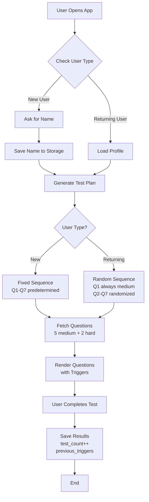

## New User Flow

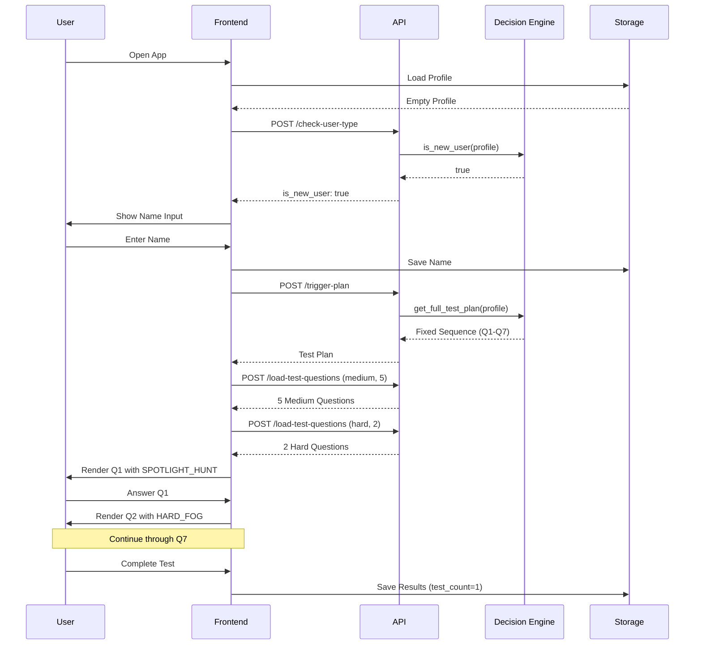

## Returning User Flow

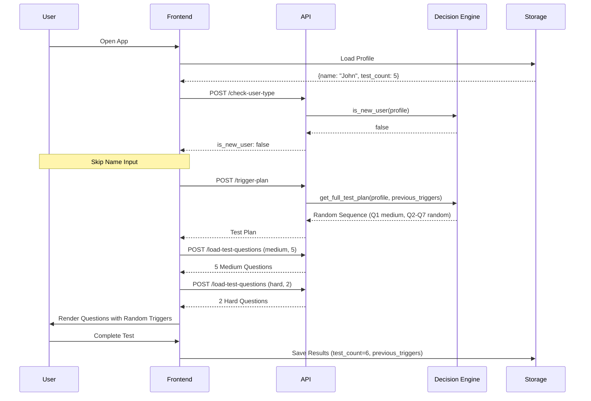

## Decision Engine Logic

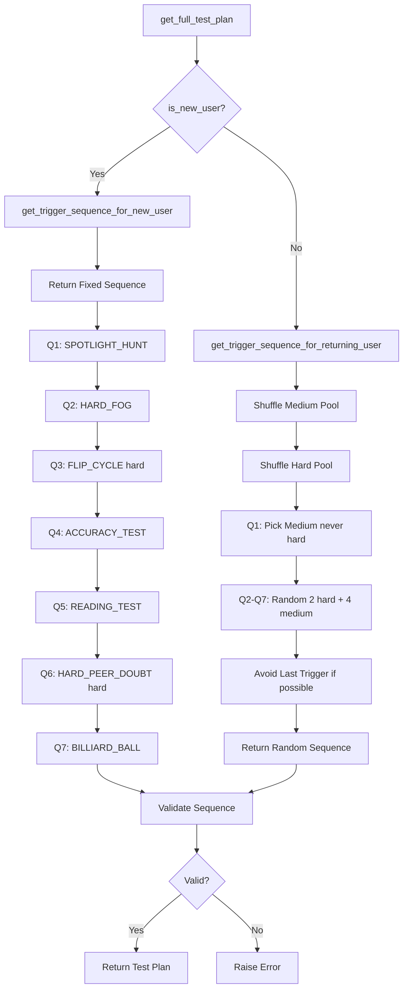

## Trigger Selection for Returning Users

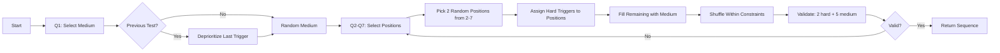

## Validation Flow

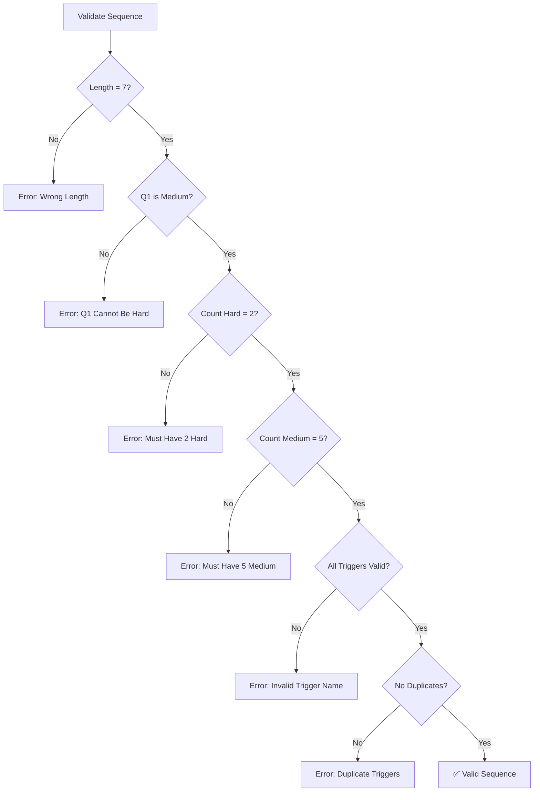

## Trigger Intensity Progression (New Users)

```mermaid
gantt
    title Trigger Intensity Over 7 Questions (New Users)
    dateFormat X
    axisFormat %s

    section Intensity
    Mild (Q1)           :0, 1
    Strong (Q2)         :1, 2
    Strong Hard (Q3)    :crit, 2, 3
    Moderate (Q4)       :3, 4
    Moderate (Q5)       :4, 5
    Strong Hard (Q6)    :crit, 5, 6
    Moderate (Q7)       :6, 7
```

## API Endpoint Architecture

```mermaid
graph LR
    A[Frontend] --> B[API Layer]
    B --> C[/check-user-type]
    B --> D[/trigger-plan]
    B --> E[/trigger/question_number]
    
    C --> F[Decision Engine]
    D --> F
    E --> F
    
    F --> G[is_new_user]
    F --> H[get_full_test_plan]
    F --> I[get_trigger_for_question]
    
    G --> J[User Profile]
    H --> J
    I --> J
    
    J --> K[Constants]
    K --> L[QUESTION_TRIGGERS]
    K --> M[QUESTION_TRIGGER_META]
    K --> N[NEW_USER_TRIGGER_SEQUENCE]
```

## Data Flow

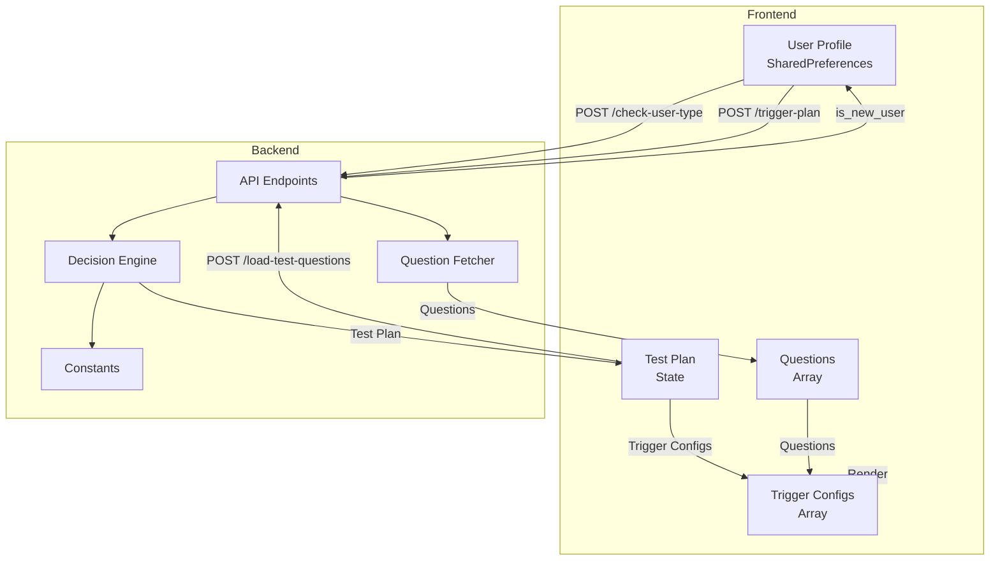

## Trigger Application Timeline

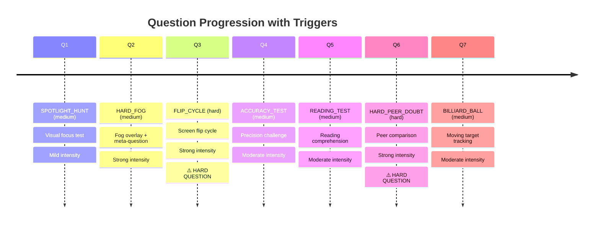

## State Machine

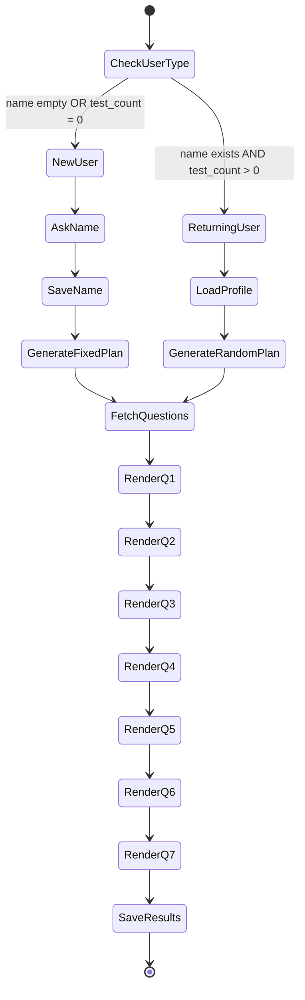

## Constraint Enforcement

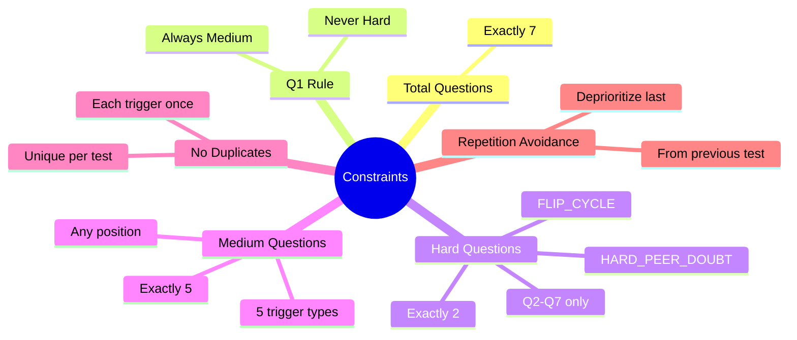

## Error Handling Flow

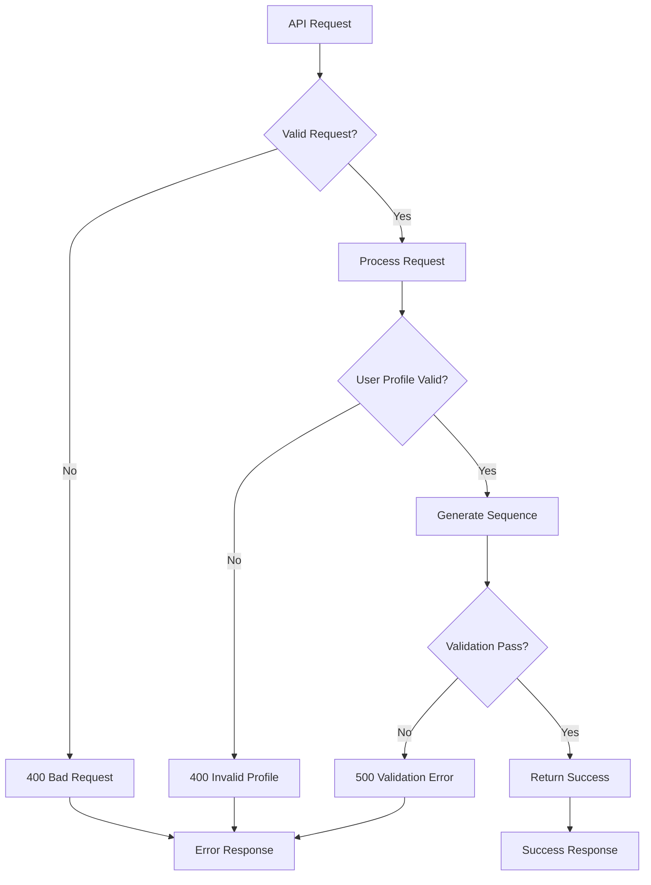

## Performance Optimization

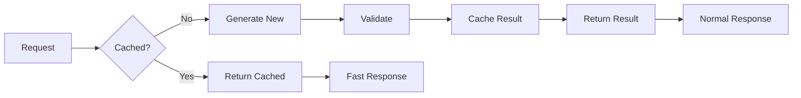

## Integration Points

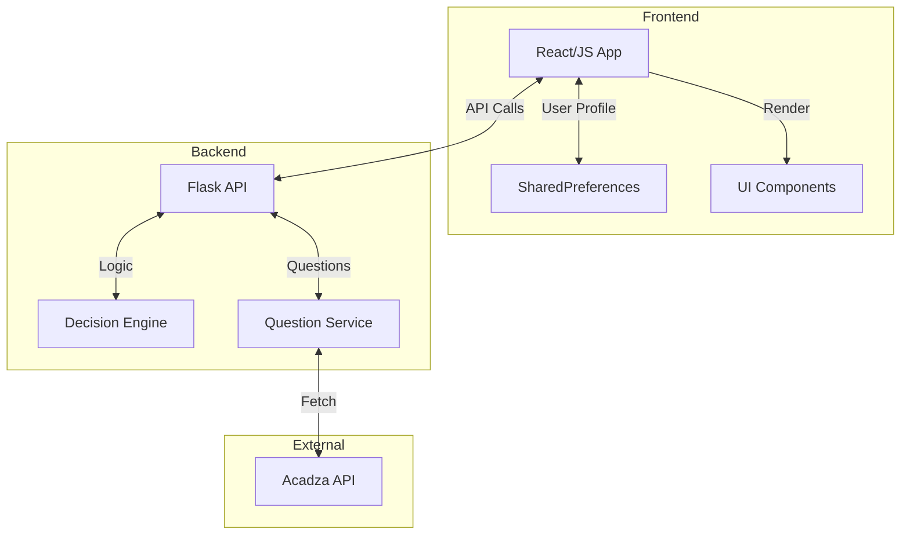

## Legend

- 🟢 **Green**: Success path
- 🔴 **Red/Critical**: Hard questions or errors
- 🟡 **Yellow**: Medium questions
- ⚠️ **Warning**: Important constraints
- ✅ **Check**: Validation passed
- ❌ **Cross**: Validation failed

